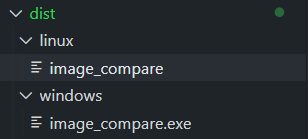
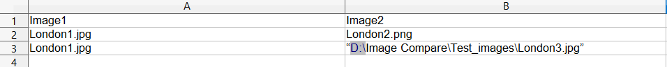
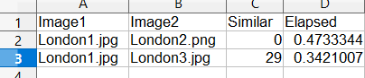
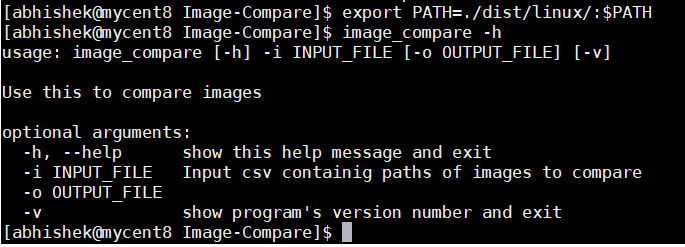
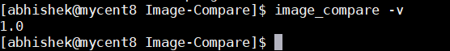
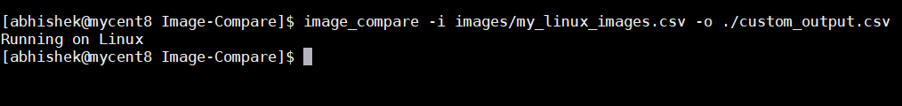
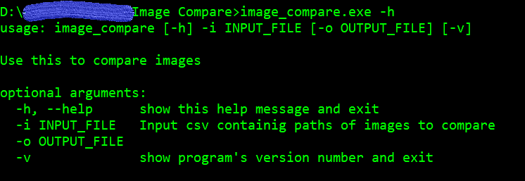
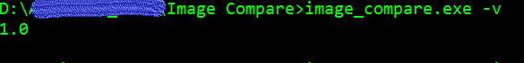
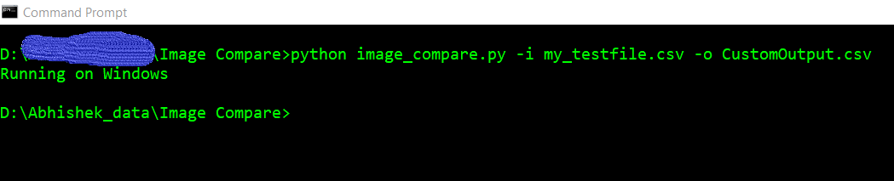

# Image-Compare

Image comapre is a python script that reads an input csv file and can compares two images provided on each row. 
The utility uses [imagehash](https://pypi.org/project/ImageHash/) module for core image comparison.
The algorithm used was *phash*
> The utility is re-runable creating a backup of previous output files in <filename>_YYYY_MM_DD_H_M_S.csv format

## Platform Support
- The pre-built executable can be run on Windows 10, linux and Mac OSX ( Mojave and Catalina). 

- For other platforms, use the python script *image_compare.py*
## Distributions:

### Pre-build exe files
- Available for Windows 10, linux and macOS .
- These can be found under individual directories under dist folder. 



##### Linux : 
The utility has been tested on Centos 7, Centos 8 ,Ubuntu 20.04.1 LTS and Vagrant.

[linux](dist/linux/image_compare)
##### Windows : 
The utility has been tested on windows 10

[windows](dist/windows/image_compare.exe)
##### macOS :
macOS support has been tested on Mojave and Catalina . 
The distribution has been code-signed using self generated certificates.

[macOS](dirs/../dist/mac/image_compare)

###  Python script setup
The code base folder contains the *image_compare.py* python script 

> To run as a python script, follow the instructions below.

##### Pre-requisites:
1. Python 3.5 or greater
2. imagehash
3. Pillow
###### Check python version:
``` python
        python3 --version
```
###### Install python module dependencies using pip:
Module dependencies are  bundled together in [requirments.txt](requirments.txt) and can be installed using 
```python
       python3 -m pip install -r requirments.txt
```

### Input parameters and Output file
#### Input csv file: 
    Required 
###### Input csv file format



##### Output csv file: 
    optional (defaults to *{inputfilename}_results.csv*)
    ** In absence of an output filename on CLI, default output file is generated.
###### output csv file sample


## Usage :
##### Linux exe:
###### Display usage help:

```bash
   ./image_compare -h
```

###### Display the version information:
```bash 
    ./image_compare -v
```

###### Execute image comparison :
```bash
 ./image_comapre -i <input csv file> -o <output csv file> *(Optional)
```



##### Windows exe:
###### Display usage help:
``` dos
image_compare -h
```

###### Display utility version:
```dos
image_compare -v
```

###### Prcoess image comparison:
```dos
image_compare -i <input csv file> -o <output csv file> *Optional*
```



#### Python script ( Linux/macOS ):
###### Display usage help:
```bash
   python image_compare.py -h
```
###### Display the version information:
```bash 
    python image_compare.py -v
```
###### Process image comparison :
```bash
 python image_compare.py -i <input csv file> -o <output csv file> *(Optional)
```

#### using python scripts (Windows):
```dos
   python image_compare.py -h
```
Display the version information:
```dos 
    python image_compare.py -v
```
Process image comparison :
```dos
 python image_compare.py -i <input csv file> -o <output csv file> *(Optional)
```


## Developer Documentation
Developer documentation is availale at

[documentation](https://htmlpreview.github.io/?https://github.com/abs13/Image-Compare/blob/master/html/image_compare.html)

## Contributing

## License
