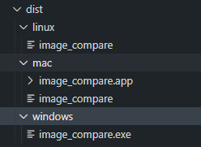

# Image-Comapre

Image comapre is a python script that reads an input csv file and can compares two images provided on each row. 
The utility uses [imagehash](https://pypi.org/project/ImageHash/) module for core image comparison.
The algorithm used was *dhash*
> The utility is re-runnable creating a backup of previous output files in <filename>_YYYY_MM_DD_H_M_S.csv format

#### Input file format


#### output file sample

## Platform Support
The utility can run on both Windows 10 and linux. 
For linux the utility has been tested on Centos 7, Centos 8 ,Ubuntu 20.04.1 LTS and Vagrant.
## Installation
The utility can be used as a pre-built executable or as a python script.
### Use pre-build exe files
Pre-built executable are available for Windows 10 and linux
These can be found under individual directories under dist folder. 
    


### Using image_compare.py script

#### Pre-requisites:
1. Python 3.5 or greater
2. imagehash
3. Pillow
#### Installing python module dependencies:
Module dependencies are  bundled together in requirments.txt
> pip install -r requirments.txt

## Usage

### Linux
Executable: [image_compare](./dist/linux/image_compare)
#### Using exe:
Display usage help:

```bash
   ./image_compare -h
```

Display the version information:
```bash 
    ./image_compare -v
```

Process image comparison :
```bash
 ./image_comapre -i <input csv file> -o <output csv file> *(Optional)
```

#### using python script:
```bash
   python image_compare.py -h
```

Display the version information:
```bash 
    python image_compare.py -v
```

Process image comparison :
```bash
 python image_compare.py -i <input csv file> -o <output csv file> *(Optional)
```
### Windows
Esecutable: [Windows](./dist/windows/image_compare.exe)
#### using exe:
Display usage help:
``` dos
image_compare -h
```

Display utility version:
```dos
image_compare -v
```

Prcoess image comparison:
```dos
image_compare -i <input csv file> -o <output csv file> *Optional*
```


#### using python script:
```dos
   python image_compare.py -h
```
Display the version information:
```dos 
    python image_compare.py -v
```
Process image comparison :
```dos
 python image_compare.py -i <input csv file> -o <output csv file> *(Optional)
```


> In absence of -o argument, default location *pwd* is used with default filename as output.csv 

## Developer Documentation
Developer documentation is availale at

[documentation]( https://htmlpreview.github.io/?/html/image_compare.html)

## Contributing

## License
